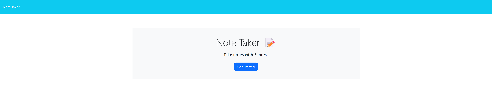
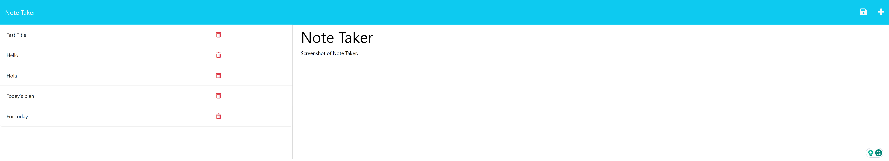

# note-taker

## Description

This assignment had a starter code and was modified to create an application called Note Taker. It can be used to write and save notes. This application uses an Express.js back end and will save and retrieve note data from a JSON file.

## Screenshot of Note Taker

## Credits
- Meg Meyers (TA)
